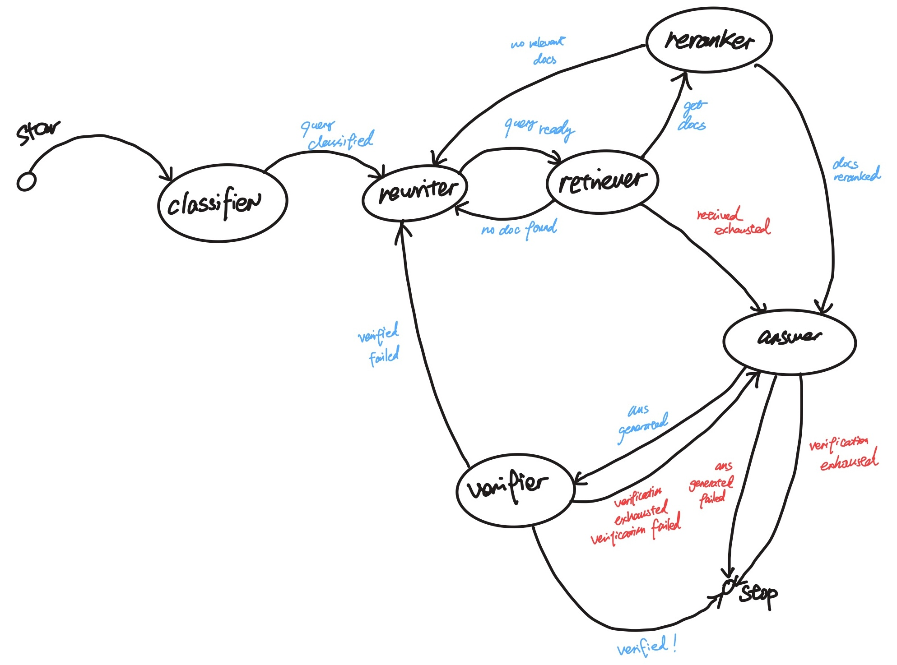

# miniRAG

A mini RAG system implemented without a RAG framework, so each step in the pipeline stays
visible and replaceable. The same components (embedding, vector store, chunking, reranker,
LLM engine) back three modes of retrieval and answering:

- **RAG pipeline**: a linear path, query transform (HyDE), dense vector retrieval, then
  generation. Single-shot, served by the streaming API.
- **Agent graph**: a predefined workflow of fixed roles with explicit routing and a
  verifier that retries when an answer is not supported by the documents.
- **Agent loop**: autonomous exploration, where the model chooses each action (search,
  inspect, or finish) under deterministic budget guards.

A local Spark and Delta pipeline builds the corpus, a FastAPI endpoint streams the steps
back over SSE, and Langfuse traces every call.

The project runs on a single machine and is intended for learning and reference rather than
as a hosted service. See "Scope" for the current limits.

## Overview

The traditional RAG steps are implemented as standalone modules. The two agent modes reuse
those same modules instead of reimplementing retrieval.

**Agent graph (predefined workflow).** Seven roles: classify the query, rewrite it,
retrieve, rerank, answer, and verify. Routing is explicit (`agents/graph/route.py`) and
bounded by step limits and retry caps. When the verifier finds an answer unsupported by the
retrieved documents, it returns the query for rewriting and retries.

**Agent loop (autonomous exploration).** A single retrieval agent (`agents/loop/agent.py`)
decides its next action at each step: search (vector or keyword), inspect a candidate
document, or finish. Deterministic guards gate the actions before they run: search and
inspection budgets, rejection of duplicate searches, and a minimum-evidence bar before the
agent is allowed to finish.

### Implementation notes

- Citations (agent graph) are validated against the IDs of the documents that were
  retrieved, so an unfounded reference is discarded. On the final attempt the model is
  instructed to state that the evidence is insufficient rather than answer regardless.
- The Spark pipeline is a bronze/silver/gold Delta lakehouse. It runs offline to build the
  index and is never on the request path, so the API installs without PySpark.
- Every agent and LLM call is traced in Langfuse. The API emits one SSE event per step.
- Embedding, reranker, and vector store sit behind interfaces, allowing OpenRouter or local
  sentence-transformers backends without changes to the query code.

## Architecture


Agent graph:



## Layout

| Path | Contents |
|------|----------|
| `src/minirag/` | RAG core: embedding, vector store, chunking, reranker, LLM engine, HyDE |
| `src/minirag/rag.py` | Linear RAG pipeline |
| `src/minirag/agents/graph/` | Agent graph: orchestrator, routing, shared state, verifier loop |
| `src/minirag/agents/loop/` | Agent loop: autonomous retrieval agent with action budgets |
| `src/minirag/agents/tool.py` | Search tools (vector / keyword) shared by both agent modes |
| `src/minirag/spark/` | Bronze/silver/gold Delta lakehouse pipeline |
| `api/` | FastAPI SSE streaming endpoint |
| `eval/`, `evaluate.py` | QA dataset and retrieval/answer evaluation |
| `tests/` | Unit tests (status below) |

## Running

Requires [`uv`](https://docs.astral.sh/uv/). Set `OPENROUTER_API_KEY` in `.env`; remaining
settings are defined in `src/minirag/config.py`.

```bash
uv sync                                    # core deps
uv run python scripts/index_docs_online.py # build the vector index
bash scripts/run_api.sh                    # RAG pipeline as a streaming API on :8000
uv run python -m minirag.agents.graph.orchestrator      # run the agent graph
uv run python -m minirag.agents.loop.agent "your question"  # run the agent loop
```

Query the API (SSE, one event per step):

```bash
curl -N "http://localhost:8000/query?question=Explain+the+Java+exception"
```

Offline data plane (separate `spark` group, requires Java for Spark 4):

```bash
uv run --group spark python scripts/spark_smoke.py   # verify Spark + Delta
uv run --group spark python -m minirag.spark.gold    # build the gold table
```

Local backends instead of hosted models:

```bash
uv sync --extra local   # sentence-transformers + spaCy
```

## Test status

```bash
uv run pytest
```

The core suite passes: API, RAG pipeline, agent routing, vector store, query transform,
and config (45 tests). Four files cover the optional local backends (`test_embedding`,
`test_reranker`, `test_document`, `test_evaluator`) and require the `local` extra. Without
`uv sync --extra local`, they fail at import because sentence-transformers and spaCy are
absent.

## Architecture decisions

### No RAG framework on the query path

A framework such as LangChain or LlamaIndex would cover this use case. It is left out on
purpose, because the goal here is to understand what those frameworks do internally rather
than to consume them. Only LlamaIndex's document layer is used, for loading and parsing;
retrieval, the agent loop, routing, and verification are built from first principles. The
resulting loop matches the design LangGraph converges on: a shared state, node functions,
and explicit routing with exit conditions.

The tradeoff is more code to write and maintain, and no framework ecosystem to lean on.
The benefit is that the same mental model transfers to any framework afterward, since the
underlying mechanics are already understood rather than hidden behind an abstraction.

### Verifier retry loop instead of a single-shot answer

The agent graph rewrites the query and retries retrieval rather than answering in one pass.
Rewriting gives retrieval more than one chance to surface relevant documents, and the
verifier turns answer quality into an explicit gate: an answer that is not supported by the
retrieved documents sends the query back for another attempt instead of being returned.

The tradeoff is higher latency and cost, since a single query can trigger several LLM calls.
It is accepted here because a supported answer is worth more than a fast but unfounded one,
and the retry count is capped so the extra cost stays bounded.

### Spark and Delta offline only, not on the request path

The Spark and Delta lakehouse builds the corpus offline and never runs during a query. This
keeps the repository mini: understanding the concepts and the architecture comes first, so
the data plane is deliberately not spread out into a streaming or online system. The API
also stays installable without PySpark, so the query path has no heavy dependency.

The tradeoff is that indexing is a separate batch step rather than continuous ingestion.
Because the interface between the offline lakehouse and the query path stays fixed, the data
plane can be made more complex later without changing the query code.

### Swappable hosted and local backends

Embedding, inference, reranker, and vector store each sit behind an interface, and the
concrete backend is assembled in one place (`api/deps.py`) by dependency injection. The
query code depends on the interface, not on whether the model runs on OpenRouter or locally,
so switching is a change to the assembly plus `uv sync --extra local`. Local backends are an
optional dependency, so the hosted path does not pull in the heavier local model libraries.

This decoupling covers compliance, cost, migration, and modularity at once, which a
non-trivial system usually needs. Tight coupling makes later upgrades of any one module
expensive; decoupling early behind fixed, explicit interfaces keeps each module replaceable
and lets a regulated environment run local models for data governance while development uses
hosted APIs. The tradeoff is an extra layer of abstraction over calling a provider SDK
directly, which is the cost of keeping those options open.

<!--
TODO: complete together. One entry per decision: the choice, the reason, and the
tradeoff accepted. Remaining topics:

- Citation validation against retrieved IDs
-->

## Scope

- Single machine: Chroma on disk, Spark in `local[*]`, conversation history in memory.
- The Spark lakehouse only builds the corpus and is not on the request path.
- The API has no authentication or rate limiting.
- MCP tool exposure and CI/CD gating are not yet implemented.
